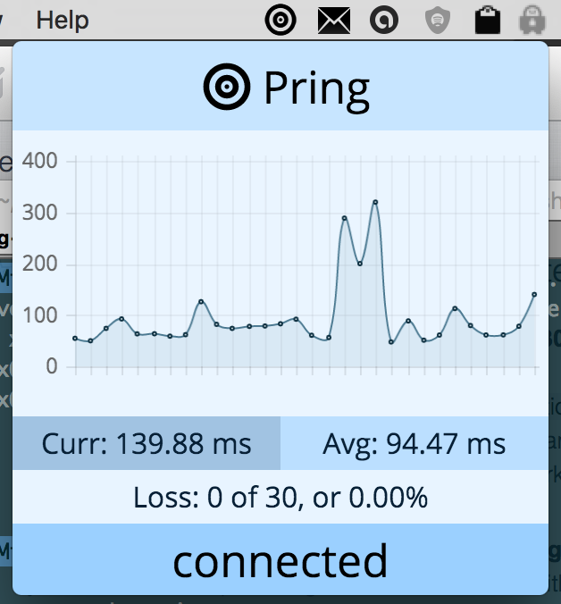
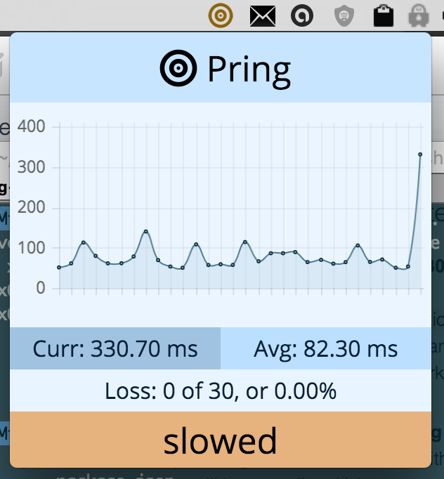
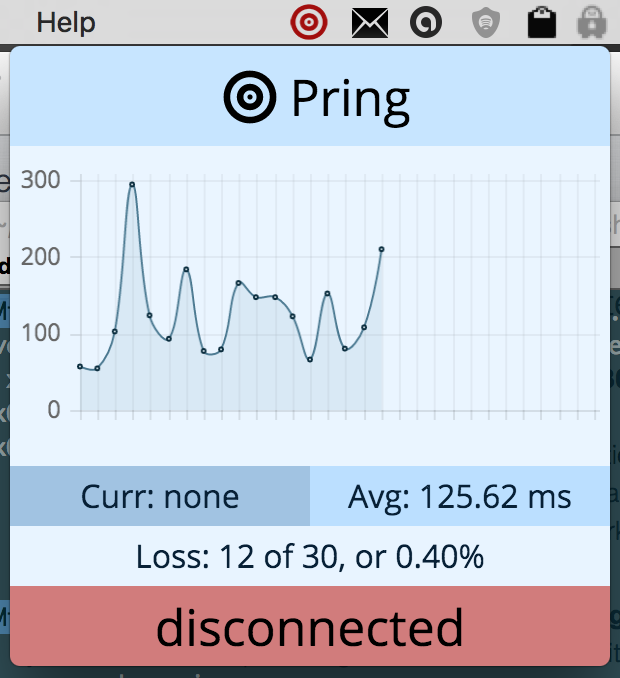

# Pring
simple task bar program for easily checking internet connectivity stats

For <a href='./binaries/Pring-darwin-x64/Pring.app'>OS X</a>, <a href='./binaries/Pring-win32-x64/Pring.exe'>Windows</a> (untested), and <a href='./binaries/Pring-linux-x64/'>Linux</a> (untested).

Pring gives you statistics on your ping, and shows your current connectivity status in the status bar. Useful for when you're connected to a network but disconnected from the internet. When clicked on, Pring shows a graph of the last 30 pings (1 ping/sec), the number of pings that didn't go through, and the average time of those that did, as well as the time of the last ping, and status (connected, slowed, disconnected).

Pring can also optionally give alerts when reconnected, slowed, or disconnected.

##Screenshots

A picture is worth a thousand words, so here's an 8k word explination:

</img>
</img>
</img>

Here's an example notification when alerts are enabled:

</img>

##License
MIT
